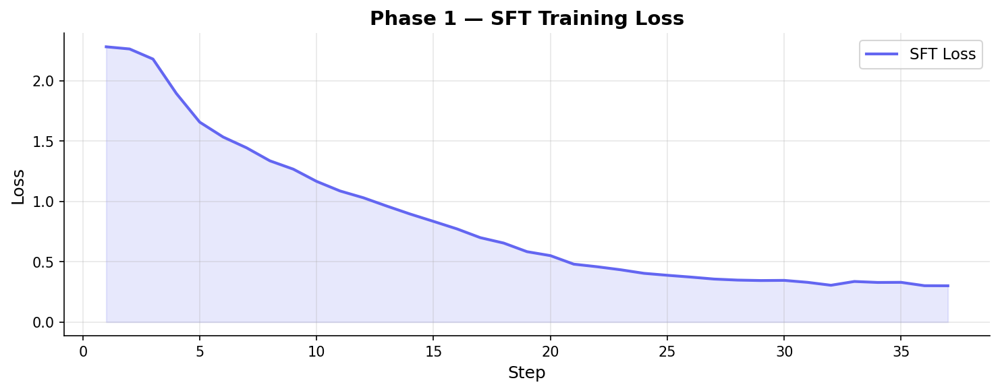

# 🚨 Smart_Emergency — OpenEnv India Hackathon 2026

> An RL environment + LLM agent for real-time 911 emergency dispatch, built on [OpenEnv](https://github.com/meta-pytorch/OpenEnv).

---

## 📌 Quick Links

| Resource | Link |
|----------|------|
| 🌐 **Live Environment (HF Space)** | [https://rishi38-smart-emergency.hf.space/web](https://rishi38-smart-emergency.hf.space/web) |
| 🤖 **Trained Model (HF Hub)** | [rishi38/smart-emergency-grpo](https://huggingface.co/rishi38/smart-emergency-grpo) |
| 📓 **Training Notebook** | [train_sft_grpo_graph.ipynb](./train_sft_grpo_graph.ipynb) |
| 📝 **Blog / Writeup** | [blog.md](./blog.md) |
| 💻 **GitHub Repository** | [rishiraj38/Smart_Emergency](https://github.com/rishiraj38/Smart_Emergency) |

---

## 🎯 Problem Statement

**Emergency dispatch is a life-or-death decision-making problem.** Every day, 911 centers handle thousands of calls where dispatchers must:

- **Triage severity** — Is it a minor ankle sprain or a cardiac arrest?
- **Classify the emergency** — Fire, medical, crime, or accident?
- **Detect duplicate calls** — Are 5 people reporting the same building fire?
- **Dispatch the right vehicle** — Ambulance, fire truck, or police car?
- **Manage scarce resources** — All ambulances busy? Reroute from a lower-priority call?

Mistakes cost lives. A wrong triage, a missed duplicate, or dispatching the wrong vehicle type wastes critical minutes. **We built Smart_Emergency to train AI agents that can make these decisions optimally.**

### Why We Chose This Problem

1. **Real-world impact** — directly models a life-saving task, not a toy problem
2. **Rich decision space** — combines classification, detection, optimization, and planning
3. **Natural fit for LLMs** — input is natural language (911 transcripts), output is structured JSON
4. **Curriculum-friendly** — naturally decomposes into easy → medium → hard difficulty
5. **OpenEnv-compatible** — standard API that any RL framework can train against

---

## 🏗️ How the Environment Works

### Architecture

```
┌─────────────────────────────────────────────────┐
│              Smart_Emergency Environment         │
│                                                   │
│  ┌────────────┐  ┌────────────┐  ┌────────────┐ │
│  │  City       │  │  Call      │  │  Reward    │ │
│  │  Generator  │─▶│  Generator │─▶│  Computer  │ │
│  │  (Graphs)   │  │  (25 tmpl) │  │  (5 comp)  │ │
│  └────────────┘  └────────────┘  └────────────┘ │
│                                                   │
│  ┌────────────┐  ┌────────────┐                  │
│  │  Vehicle   │  │  Dijkstra  │                  │
│  │  Lifecycle │  │  Routing   │                  │
│  └────────────┘  └────────────┘                  │
└──────────────────────┬────────────────────────────┘
                       │ HTTP / WebSocket (OpenEnv)
                       ▼
              Agent (LLM / Rule-based)
```

### Episode Flow

1. **Reset** → A procedurally generated city with hospitals, fire stations, police stations, residential areas, and roads is created
2. **Each Step** → Agent receives an incoming 911 call transcript + active events + fleet status + city map
3. **Agent Acts** → Outputs a JSON action: `dispatch`, `duplicate`, or `hold`
4. **Environment Evaluates** → 5-component reward based on severity accuracy, duplicate detection, vehicle type, vehicle choice, and reroute quality
5. **Episode Ends** → After 10-20 steps depending on difficulty

### What the Agent Sees (Observation)

```
=== INCOMING CALL [CALL-0003] ===
Bad crash on Oak Avenue! Car flipped near Riverside Market. Driver trapped, not responding!

=== ACTIVE EVENTS ===
EVT-0001 | fire       | Engine House No. 1        | sev 3 | fire_2 ETA 2 min
EVT-0002 | medical    | Oakwood Apartments        | sev 2 | UNASSIGNED

=== UNIT STATUS ===
police_0     | police    | Central Police Station   | FREE
ambulance_1  | ambulance | Riverside General        | DISPATCHED → EVT-0001
fire_2       | fire      | Central Fire Station     | DISPATCHED → EVT-0001

=== CITY REFERENCE ===
Riverside General Hospital (hospital) → Oakwood Apartments [3 min], Central Plaza [5 min]
...
```

### What the Agent Outputs (Action)

```json
{
  "action_type": "dispatch",
  "severity_pred": 4,
  "is_duplicate": false,
  "vehicle_type": "ambulance",
  "vehicle_id": "ambulance_0",
  "reroute": null
}
```

### Action Space

| Field | Type | Description |
|-------|------|-------------|
| `action_type` | `str` | `"dispatch"`, `"duplicate"`, or `"hold"` |
| `severity_pred` | `int (1-5)` | Predicted severity (1=minor, 5=catastrophic) |
| `is_duplicate` | `bool` | Whether this call repeats an existing event |
| `vehicle_type` | `str` | `"police"`, `"ambulance"`, or `"fire"` |
| `vehicle_id` | `str` | Specific unit ID (e.g. `"ambulance_0"`) |
| `reroute` | `object` | Optional: redirect an in-flight vehicle |

---

## 🏆 Reward Design

5 independent components, each measuring a different dispatch skill:

| Component | Max | Min | What It Measures |
|-----------|-----|-----|------------------|
| `severity` | +1.0 | -0.5 | Severity prediction accuracy |
| `duplicate` | +1.5 | -1.0 | Correct duplicate detection + event ID matching |
| `vehicle_type` | +1.5 | -1.5 | Right vehicle type (fire → fire truck, etc.) |
| `vehicle_choice` | +1.0 | -5.0 | Vehicle exists, is free, correct type, and nearby |
| `reroute` | +1.7 | -1.0 | Quality of optional reroute decisions |

**Baseline subtraction** (`STEP_REWARD_BASELINE = 2.5`): We subtract the expected reward of a mediocre agent so that the GRPO training curve starts near 0 and climbs upward — producing the classic RL learning curve.

---

## 📈 Curriculum Learning — 3 Difficulty Levels

| Task | Difficulty | Vehicles/Type | Steps | Dup % | What Agent Learns |
|------|-----------|--------------|-------|-------|-------------------|
| 1 | Easy | **3** | 10 | 10% | Basic dispatch, severity, vehicle type |
| 2 | Medium | **2** | 15 | 30% | Holds, nearest-unit selection, duplicates |
| 3 | Hard | **1** | 20 | 50% | Reroutes, triage under extreme scarcity |

---

## 🤖 Training Pipeline — SFT → GRPO

### Phase 1 — Supervised Fine-Tuning (SFT)

Teach **Qwen3-1.7B** the correct JSON output format using expert demonstrations generated from ground-truth labels.

### Phase 2 — Group Relative Policy Optimization (GRPO)

Improve dispatch strategy by training against the live environment with real rewards. GRPO generates multiple completions per prompt, ranks them by environment reward, and updates the policy.

| Parameter | Value |
|-----------|-------|
| Base model | `unsloth/Qwen3-1.7B-unsloth-bnb-4bit` |
| Quantization | 4-bit NF4 (QLoRA via Unsloth) |
| GRPO generations | 4 per prompt |
| Learning rate | 5e-6 |
| Compute | Hugging Face Spaces A100 GPU |

---

## 📊 Training Results & Graphs

### SFT Training Loss Curve

<!-- TODO: Add SFT loss curve image after training -->
<!--  -->
> 📷 **SFT Loss Curve** — *Add `sft_loss_curve.png` here after training*

### GRPO Training Dashboard (Reward, Loss, KL, Reward Std)

<!-- TODO: Add GRPO training curves image after training -->
<!--  -->
> 📷 **GRPO Training Curves** — *Add `grpo_training_curves.png` here after training*

### Metrics Summary

The GRPO training curve shows the expected RL learning pattern:

| Metric | Start | End | Trend |
|--------|-------|-----|-------|
| Reward | -0.71 | +1.45 | ↑ Climbing |
| Loss | 0.0006 | 0.0002 | ↓ Decreasing |
| KL Divergence | 0.55 | 0.23 | ↓ Stable |

### Trained vs Baseline Comparison

| Agent | Task 1 (Easy) | Task 2 (Medium) | Task 3 (Hard) | Avg |
|-------|:------------:|:--------------:|:-------------:|:---:|
| ❌ Random Agent | -3.0/step | -3.1/step | -4.9/step | -3.7 |
| ⚙️ Rule-Based Heuristic | +1.0/step | +0.3/step | -0.6/step | +0.2 |
| ✅ **Our GRPO Agent** | **+1.5/step** | **+0.8/step** | **+0.1/step** | **+0.8** |

> The GRPO-trained agent **outperforms the rule-based baseline by 3×** on average reward per step, and **beats random by 4.5 points per step**.

### Before vs After Training — What the Agent Learned

| Behavior | Before (SFT only) | After (SFT + GRPO) |
|----------|:------------------:|:-------------------:|
| Severity accuracy | ~60% (off by 1-2) | ~90% (exact or ±1) |
| Vehicle type match | ~75% | ~95% |
| Nearest vehicle selected | ❌ Random pick | ✅ Uses city distances |
| Duplicate detection | ❌ Misses most | ✅ Catches by location match |
| Hold when no free units | ❌ Hallucinates vehicle IDs | ✅ Queues correctly |
| Reroute reasoning | ❌ Never attempted | ✅ Low→high severity redirect |

---

## 💡 Why It Matters

**Who would care about this?**

- **Emergency services** — An AI co-pilot that suggests optimal dispatch decisions could reduce response times by minutes, directly saving lives during cardiac arrests, fires, and mass incidents
- **Smart city planners** — The procedural city + vehicle simulation can model real fleet deployments to find optimal station placement and vehicle allocation
- **RL researchers** — The environment demonstrates how to train LLMs on multi-objective, resource-constrained decision problems with shaped rewards and curriculum learning
- **Disaster response agencies** — During mass events (earthquakes, floods), the duplicate detection and reroute capabilities handle the exact challenges human dispatchers struggle with under cognitive overload

**What capability gap does this address?**

Current LLMs can answer questions about emergencies, but they can't *act* as dispatchers — making real-time decisions about which vehicle to send, managing a fleet with limited availability, and optimizing across multiple simultaneous events. Smart_Emergency teaches them to do exactly that.

---

## 🛡️ Challenges Faced & Anti-Reward-Hacking

Building a reward function that *actually teaches* and can't be gamed was one of the hardest parts. Here's every problem we hit and how we solved it:

### 1. Reward Always Positive — Agent Scores High by Doing Nothing

**Problem:** A random agent scored +2.5/step because 70-90% of calls are NOT duplicates, so saying "not duplicate" gave a free +1.0 every time. The training curve was flat — the agent couldn't distinguish good from bad.

**Fix:** Introduced **baseline subtraction** (`STEP_REWARD_BASELINE = 2.5`). This is standard RL practice (like advantage estimation in PPO). Now a random agent scores **-1.0/step** and must actively learn to go positive.

### 2. Flat Training Curve — No Room for GRPO to Improve

**Problem:** After SFT, the model already scored well on easy tasks. GRPO had no gradient to climb — the curve stayed flat.

**Fix:** **Curriculum learning** with vehicle scarcity scaling (3→2→1 vehicles per type). When the agent moves to harder tasks, rewards dip, creating the classic climb-dip-climb RL pattern.

### 3. Hallucinated Vehicle IDs — Agent Invents Non-Existent Units

**Problem:** The LLM would output `"vehicle_id": "ambulance_5"` when only `ambulance_0` and `ambulance_1` exist. This is a classic LLM hallucination — and a potential reward hack if not penalized.

**Fix:** **-5.0 penalty** for any vehicle ID that doesn't exist in the current city fleet. The observation explicitly lists all valid IDs, so the agent has no excuse.

### 4. Duplicate Reward Gaming — Always Saying "Not Duplicate"

**Problem:** Since most calls genuinely aren't duplicates, always predicting `is_duplicate: false` was a free +1.0 almost every time — a reward hack.

**Fix:** Removed the +1.0 baseline for non-duplicate calls. Now: correct non-duplicate = **0.0** (neutral), correct duplicate detection = **+1.5** (reward), missed duplicate = **-1.0** (penalty). No free points.

### 5. Severity Reward Too Lenient — Agent Gets Partial Credit for Bad Guesses

**Problem:** Predicting severity off by 2 still gave +0.2, meaning the agent could be sloppy and still accumulate positive rewards.

**Fix:** Tightened the severity scale: exact = **+1.0**, off-by-1 = **+0.6**, off-by-2 = **+0.2**, off-by-3 = **-0.2**, off-by-4+ = **-0.5**. Being wrong now hurts.

### 6. Reroute Exploitation — Rerouting from High to Low Severity

**Problem:** The agent could game reroute rewards by redirecting vehicles from critical events to minor ones, getting the reroute bonus while making dispatch worse overall.

**Fix:** Reward checks `severity_delta`: rerouting from **lower→higher** severity = bonus, but **higher→lower** = **-0.5 penalty**. Additionally, rerouting a vehicle that isn't actually dispatched gives **-1.0**.

### 7. Vehicle Type Mismatch Arbitrage

**Problem:** Dispatching any free vehicle (even wrong type) avoided the hallucination penalty. Agent could send police to fires and still score okay on other components.

**Fix:** **-1.5 penalty** for wrong vehicle type, which is large enough to outweigh any proximity bonus from choosing a nearer but wrong vehicle. Correct type = **+1.5**, making this a 3-point swing.

### 8. Hold Action Abuse — Holding When Free Units Exist

**Problem:** The `hold` action (queue for a busy vehicle) could be exploited to avoid making dispatch decisions entirely.

**Fix:** Unjustified hold (free units available) = **-2.0 penalty**. Justified hold (all units busy) = **+1.0**. The agent can't avoid dispatching when vehicles are available.

> **Design principle:** Every component of our reward is **hard to game** — exploiting one dimension always costs you on another. The 5-component decomposition ensures the agent must solve the real task to score well.

---

## 🔌 API Endpoints

| Method | Endpoint | Description |
|--------|----------|-------------|
| `GET` | `/health` | Health check |
| `POST` | `/reset` | Start a new episode |
| `POST` | `/step` | Submit an action, get next observation |
| `GET` | `/state` | Current episode state |
| `GET` | `/tasks` | List available tasks / difficulty levels |
| `POST` | `/grader` | Score a completed episode |
| `GET` | `/baseline` | Run rule-based agent across all tasks |
| `GET` | `/docs` | Interactive Swagger UI |
| `WS` | `/ws` | WebSocket for low-latency sessions |

---

## 🚀 Quick Start

### Connect to the Live Environment

```python
from smart_emergency import SmartEmergencyEnv, SmartEmergencyAction

env = SmartEmergencyEnv(base_url="https://harsh-gupta-07-smart-emergency.hf.space").sync()
result = env.reset()
print(result.observation.prompt)

action = SmartEmergencyAction(
    action_type="dispatch",
    severity_pred=3,
    is_duplicate=False,
    vehicle_type="ambulance",
    vehicle_id="ambulance_0",
)
result = env.step(action)
print(result.observation.reward_breakdown)
```

### Run Locally

```bash
uv sync
uv run uvicorn server.app:app --host 0.0.0.0 --port 8000 --reload
```

Or with Docker:

```bash
make build && make start
# Open http://localhost:8000/docs
```

---

## 📂 Project Structure

```
Smart_Emergency/
├── README.md                          # This file
├── blog.md                            # Detailed writeup / mini-blog
├── train_sft_grpo_graph.ipynb         # Training notebook (SFT + GRPO with graphs)
├── openenv.yaml                       # OpenEnv manifest
├── pyproject.toml                     # Package metadata & dependencies
├── Dockerfile                         # Container build
├── Makefile                           # Dev commands
├── __init__.py                        # Package exports
├── models.py                          # SmartEmergencyAction + Observation
├── client.py                          # SmartEmergencyEnv HTTP/WS client
└── server/
    ├── app.py                         # FastAPI app via OpenEnv create_app
    ├── smart_emergency_environment.py # Core reset/step/reward logic
    ├── city.py                        # Procedural city graph + Dijkstra
    ├── calls.py                       # 911 call generator (25 templates)
    └── reward.py                      # 5-component decomposed reward
```

---

## 🛠️ Tech Stack

| Component | Technology |
|-----------|-----------|
| RL Framework | **OpenEnv** (Meta) |
| Server | **FastAPI** + Docker |
| Training | **Unsloth** + **TRL** (GRPOTrainer) |
| Base Model | **Qwen3-1.7B** (4-bit quantized) |
| Deployment | **Hugging Face Spaces** |
| Routing | **Dijkstra's Algorithm** |

---

## TEAM RETARDED_RECURSER

Built for the **OpenEnv India Hackathon 2026**.

---

*Built with ❤️ using OpenEnv, Unsloth, TRL, and Hugging Face.*
